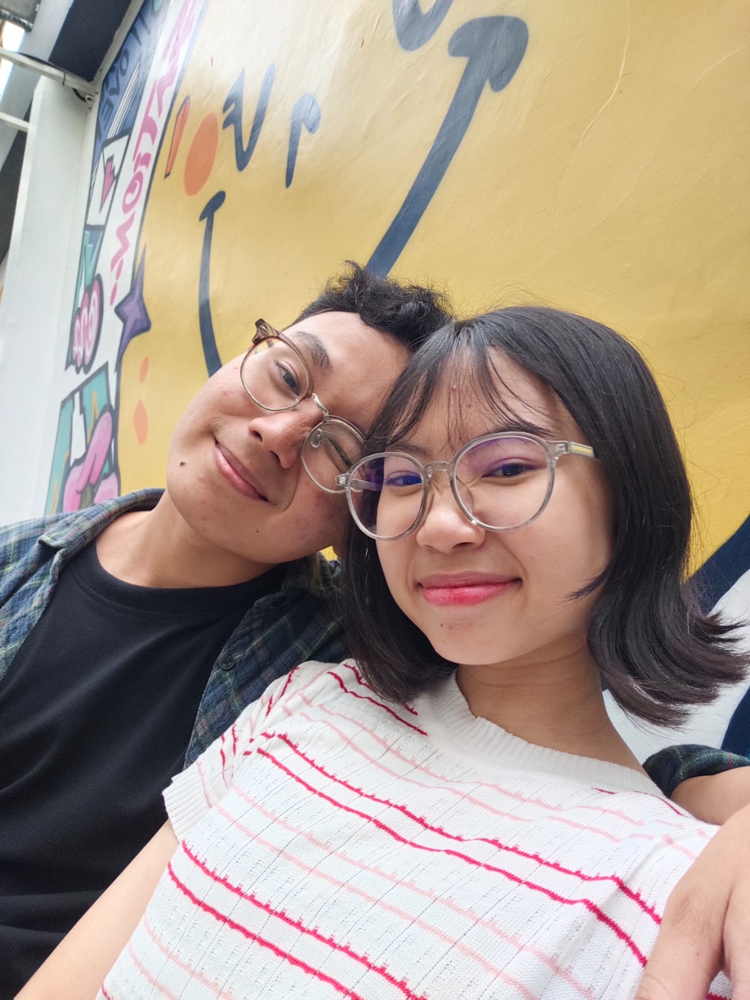

<!DOCTYPE html>
<html lang="id">
<head>
    <meta charset="UTF-8">
    <meta name="viewport" content="width=device-width, initial-scale=1.0">
    <title>Ucapan Cinta</title>
    <link rel="stylesheet" href="css love.css">
</head>
<body>
    

        <h1>Hai Ayangggg! 💌</h1>
        
Klik tombol di bawah ini sayang untuk melihat sesuatu yang spesial!

        <button onclick="tampilkanUcapan()">Klik Aku 💕</button>
        

            
✨ Aku cuma mau bilang... ✨

            <h2>🌹 Aku sayang kamu! 🌹</h2>
             
            
Terima kasih sudah hadir dalam hidupku, semoga kita bisa lewatin ini semua. 😘

        

    

    
</body>
</html>

function tampilkanUcapan() {
    const ucapan = document.getElementById('ucapanCinta');
    ucapan.classList.remove('hidden');
}

body {
    font-family: 'Segoe UI', sans-serif;
    background: linear-gradient(to right, #ffafbd, #ffc3a0);
    display: flex;
    justify-content: center;
    align-items: center;
    height: 100vh;
    margin: 0;
}

.container {
    background-color: white;
    padding: 30px;
    border-radius: 15px;
    text-align: center;
    box-shadow: 0 8px 16px rgba(0,0,0,0.2);
    max-width: 400px;
}

button {
    padding: 10px 20px;
    font-size: 16px;
    background-color: #ff6f91;
    border: none;
    border-radius: 10px;
    color: white;
    cursor: pointer;
    transition: background-color 0.3s ease;
}

button:hover {
    background-color: #ff3e6c;
}

#ucapanCinta {
    margin-top: 20px;
    animation: fadeIn 2s;
}

.hidden {
    display: none;
}

.gallery-img {
    width: 250px;
    height: auto;
    border-radius: 10px;
    cursor: pointer;
    transition: transform 0.3s ease;
    box-shadow: 0 4px 8px rgba(0,0,0,0.2);

}
@keyframes fadeIn {
    from { opacity: 0; transform: translateY(10px); }
    to { opacity: 1; transform: translateY(0); }
}
